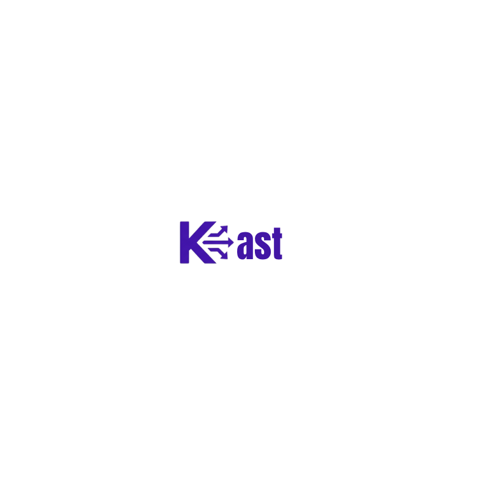

<div align="center">



# Kast CMS

### Cast Your Content Everywhere

**Open-source · AI-native · Developer-first · RTL-ready**

[](https://github.com/kast-cms/kast/stargazers)
[](./LICENSE)
[](https://nodejs.org/)
[](https://www.typescriptlang.org/)
[](https://pnpm.io/)
[](https://github.com/orgs/kast-cms/packages)

<br />

[](https://www.npmjs.com/package/@kast-cms/sdk)
[](https://www.npmjs.com/package/@kast-cms/plugin-sdk)
[](https://www.npmjs.com/package/create-kast-app)

<br />

Kast is a modern headless CMS built on **NestJS + Next.js** with a built-in **MCP server** for AI agent control, first-class **SEO tooling**, and **RTL/i18n** support from day one.

[**Docs**](https://kastcms.com/docs) · [**Quick Start**](#quick-start) · [**SDK**](https://www.npmjs.com/package/@kast-cms/sdk) · [**Plugins**](#plugins) · [**Deploy**](#deploy)

</div>

---

## Quick Start

```bash
npx create-kast-app my-site
cd my-site
# .env is copied automatically — edit it with your DB credentials
pnpm run db:migrate
pnpm run dev
```

> **Production with Docker?** A `docker-compose.yml` is included in the generated project. Run `docker-compose up` after filling in `.env`.

| Service            | URL                          |
| ------------------ | ---------------------------- |
| Admin Panel        | http://localhost:3001        |
| REST API           | http://localhost:3000/api/v1 |
| MCP Server         | http://localhost:3000/mcp    |
| API Docs (Swagger) | http://localhost:3000/api    |

---

## Why Kast?

Most headless CMSes were built for an era before AI agents, before Arabic-first products, and before SEO was a core requirement rather than an afterthought. Kast is different.

### Feature Comparison

<table>
  <thead>
    <tr>
      <th>Capability</th>
      <th align="center">Kast</th>
      <th align="center">Strapi</th>
      <th align="center">Payload</th>
      <th align="center">WordPress</th>
    </tr>
  </thead>
  <tbody>
    <tr>
      <td><strong>MCP server — AI agent control</strong></td>
      <td align="center">✅ Built-in</td>
      <td align="center">❌</td>
      <td align="center">❌</td>
      <td align="center">❌</td>
    </tr>
    <tr>
      <td><strong>SEO — not a plugin</strong></td>
      <td align="center">✅ Core</td>
      <td align="center">🔌 Plugin</td>
      <td align="center">🔌 Plugin</td>
      <td align="center">🔌 Plugin</td>
    </tr>
    <tr>
      <td><strong>RTL / Arabic first-class</strong></td>
      <td align="center">✅ Core</td>
      <td align="center">⚠️ Partial</td>
      <td align="center">⚠️ Partial</td>
      <td align="center">⚠️ Partial</td>
    </tr>
    <tr>
      <td><strong>TypeScript end-to-end</strong></td>
      <td align="center">✅ Full</td>
      <td align="center">⚠️ Partial</td>
      <td align="center">✅ Full</td>
      <td align="center">❌</td>
    </tr>
    <tr>
      <td><strong>Official TypeScript SDK</strong></td>
      <td align="center">✅ <a href="https://www.npmjs.com/package/@kast-cms/sdk">@kast-cms/sdk</a></td>
      <td align="center">⚠️ Community</td>
      <td align="center">⚠️ Community</td>
      <td align="center">❌</td>
    </tr>
    <tr>
      <td><strong>Plugin SDK + marketplace</strong></td>
      <td align="center">✅ <a href="https://www.npmjs.com/package/@kast-cms/plugin-sdk">@kast-cms/plugin-sdk</a></td>
      <td align="center">✅</td>
      <td align="center">✅</td>
      <td align="center">✅</td>
    </tr>
    <tr>
      <td><strong>Content versioning</strong></td>
      <td align="center">✅ Built-in</td>
      <td align="center">✅</td>
      <td align="center">✅</td>
      <td align="center">✅</td>
    </tr>
    <tr>
      <td><strong>Scheduled publishing</strong></td>
      <td align="center">✅ Built-in</td>
      <td align="center">✅</td>
      <td align="center">⚠️ Manual</td>
      <td align="center">✅</td>
    </tr>
    <tr>
      <td><strong>Docker images published</strong></td>
      <td align="center">✅ <a href="https://github.com/orgs/kast-cms/packages">GHCR</a></td>
      <td align="center">✅</td>
      <td align="center">❌</td>
      <td align="center">✅</td>
    </tr>
    <tr>
      <td><strong>Scaffold CLI</strong></td>
      <td align="center">✅ <a href="https://www.npmjs.com/package/create-kast-app">create-kast-app</a></td>
      <td align="center">✅</td>
      <td align="center">✅</td>
      <td align="center">✅</td>
    </tr>
    <tr>
      <td><strong>Open source</strong></td>
      <td align="center">✅ MIT</td>
      <td align="center">✅ MIT</td>
      <td align="center">✅ MIT</td>
      <td align="center">✅ GPL</td>
    </tr>
  </tbody>
</table>

---

## Stack

```
┌─────────────────────────────────────────────────────┐
│                  Kast CMS v1.0.2                    │
├──────────────┬──────────────┬───────────────────────┤
│   API        │   Admin      │   Frontend            │
│   NestJS     │   Next.js 15 │   Next.js / Any       │
│   Prisma     │   App Router │   @kast-cms/sdk       │
│   PostgreSQL │   TypeScript │                       │
├──────────────┴──────────────┴───────────────────────┤
│   BullMQ + Redis  (background jobs & queues)        │
├─────────────────────────────────────────────────────┤
│   Auth: JWT · Refresh Tokens · OAuth                │
│   Storage: Local FS · S3-compatible (pluggable)     │
│   MCP Server: AI agent protocol, built-in           │
└─────────────────────────────────────────────────────┘
```

---

## npm Packages

| Package                                                                      | Version                                                                                                                           | Description                                 |
| ---------------------------------------------------------------------------- | --------------------------------------------------------------------------------------------------------------------------------- | ------------------------------------------- |
| [`@kast-cms/sdk`](https://www.npmjs.com/package/@kast-cms/sdk)               | [](https://www.npmjs.com/package/@kast-cms/sdk)               | Official TypeScript client for the Kast API |
| [`@kast-cms/plugin-sdk`](https://www.npmjs.com/package/@kast-cms/plugin-sdk) | [](https://www.npmjs.com/package/@kast-cms/plugin-sdk) | Build your own Kast plugins                 |
| [`create-kast-app`](https://www.npmjs.com/package/create-kast-app)           | [](https://www.npmjs.com/package/create-kast-app)           | Scaffold a new Kast project in seconds      |

```bash
# Use the SDK in your frontend / Next.js app
npm install @kast-cms/sdk

# Build a Kast plugin
npm install @kast-cms/plugin-sdk

# Scaffold a new project
npx create-kast-app my-site
```

---

## Plugins

First-party plugins, installable via the Kast admin:

| Plugin                         | Description                          |
| ------------------------------ | ------------------------------------ |
| `@kast-cms/plugin-stripe`      | Payments and subscription management |
| `@kast-cms/plugin-meilisearch` | Full-text search with Meilisearch    |
| `@kast-cms/plugin-resend`      | Transactional email via Resend       |
| `@kast-cms/plugin-r2`          | Media storage on Cloudflare R2       |
| `@kast-cms/plugin-sentry`      | Error tracking and monitoring        |

Build your own with [`@kast-cms/plugin-sdk`](https://www.npmjs.com/package/@kast-cms/plugin-sdk).

---

## Monorepo Structure

```
kast/
├── apps/
│   ├── api/             # NestJS backend
│   ├── admin/           # Next.js 15 admin panel
│   ├── web-blog/        # Next.js blog frontend starter
│   └── web-docs/        # Astro documentation site
├── packages/
│   ├── sdk/             # @kast-cms/sdk — TypeScript client
│   ├── plugin-sdk/      # @kast-cms/plugin-sdk — plugin interface
│   └── create-kast-app/ # CLI scaffolding tool
└── plugins/             # First-party plugins
    ├── kast-plugin-stripe/
    ├── kast-plugin-meilisearch/
    ├── kast-plugin-resend/
    ├── kast-plugin-r2/
    └── kast-plugin-sentry/
```

---

## Development

**Prerequisites:** Node.js ≥ 20, pnpm ≥ 9, Docker

```bash
# 1. Clone
git clone https://github.com/kast-cms/kast.git
cd kast

# 2. Install dependencies
pnpm install

# 3. Configure environment
cp apps/api/.env.example apps/api/.env

# 4. Start PostgreSQL + Redis
docker-compose up -d postgres redis

# 5. Run migrations + seed
pnpm --filter @kast-cms/api run db:migrate
pnpm --filter @kast-cms/api run db:seed

# 6. Start all dev servers
pnpm dev
```

---

## Deploy

Get a production instance running in under 10 minutes:

[](https://railway.app/template/kast)
[](https://render.com/deploy?repo=https://github.com/kast-cms/kast)
[](https://vercel.com/new/clone?repository-url=https://github.com/kast-cms/kast&root-directory=apps/admin)

> **Vercel** deploys the admin panel only. Deploy the API on Railway or Render and set `NEXT_PUBLIC_API_URL` in your Vercel project settings.

### Docker

Images are hosted on GitHub Container Registry (GHCR):

```bash
# Latest stable release
docker pull ghcr.io/kast-cms/kast-api:latest
docker pull ghcr.io/kast-cms/kast-admin:latest

# Edge build (latest main branch commit)
docker pull ghcr.io/kast-cms/kast-api:edge
docker pull ghcr.io/kast-cms/kast-admin:edge
```

| Tag                | Published on           |
| ------------------ | ---------------------- |
| `latest` / `1.x.x` | Every `v*` release tag |
| `edge`             | Every merge to `main`  |

Images are built and pushed automatically via GitHub Actions.

---

## Documentation

Full docs at [kastcms.com/docs](https://kastcms.com/docs)

- [Getting Started](https://kastcms.com/docs/getting-started)
- [API Reference](https://kastcms.com/docs/api)
- [SDK Guide](https://kastcms.com/docs/sdk)
- [Plugin Development](https://kastcms.com/docs/plugins)
- [MCP Server](https://kastcms.com/docs/mcp)
- [SEO Tooling](https://kastcms.com/docs/seo)

---

## Contributing

Contributions are welcome! See [CONTRIBUTING.md](./CONTRIBUTING.md) for guidelines.

- [Report a Bug](https://github.com/kast-cms/kast/issues/new?template=bug_report.md)
- [Request a Feature](https://github.com/kast-cms/kast/issues/new?template=feature_request.md)
- [Join Discord](https://discord.gg/kast-cms)

---

## About the Author

Kast is built and maintained by **Oday Bakkour** — a full-stack engineer and open-source developer passionate about developer tooling, AI-native products, and building great experiences for Arabic-speaking users.

→ [oday-bakkour.com](https://oday-bakkour.com/)

---

## License

[MIT](./LICENSE) © 2026 Oday Bakkour
