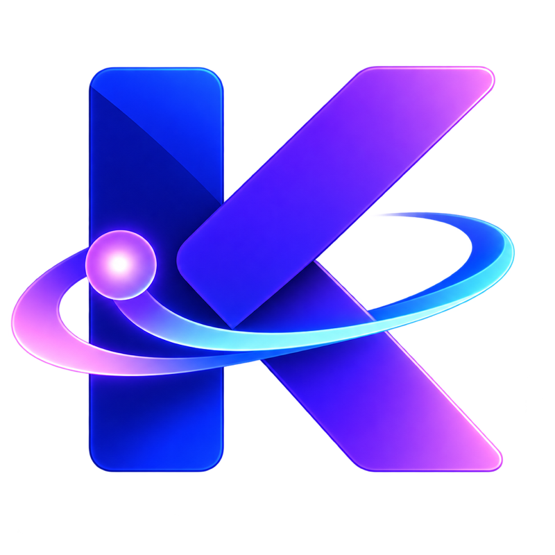
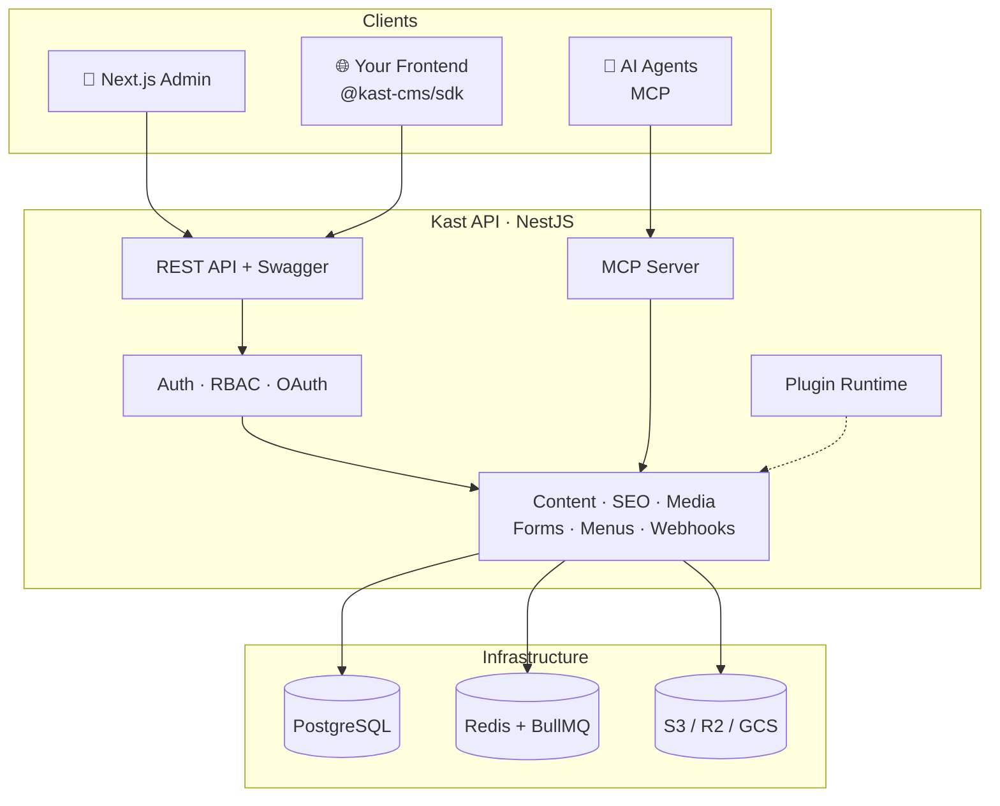

<div align="center">



<h1>Kast CMS</h1>

### Cast Your Content Everywhere

**The modern, open-source headless CMS for the AI era** — built on **NestJS + Next.js**, with a native **MCP server** for AI agents, **SEO** baked into the core, and **RTL / i18n** support from day one.

<br />

[](https://github.com/kast-cms/kast/stargazers)
[](./LICENSE)
[](https://nodejs.org/)
[](https://www.typescriptlang.org/)
[](https://pnpm.io/)
[](https://github.com/orgs/kast-cms/packages)

[](https://www.npmjs.com/package/@kast-cms/sdk)
[](https://www.npmjs.com/package/@kast-cms/plugin-sdk)
[](https://www.npmjs.com/package/create-kast-app)

<br />

[**Quick Start**](#-quick-start) · [**Features**](#-features) · [**Code in Action**](#-code-in-action) · [**Architecture**](#-architecture) · [**Deploy**](#-deployment) · [**Docs**](https://kastcms.com/docs)

</div>

---

## Why Kast?

Most headless CMSes were designed for an era _before_ AI agents, _before_ Arabic-first products, and _before_ SEO became a core requirement rather than an afterthought. Kast is built for what comes next — without sacrificing the developer experience you expect today.

<table>
  <tr>
    <td width="50%" valign="top">

### 🤖 AI-Native

A **Model Context Protocol (MCP) server is built in** — not bolted on. AI agents read, create, and publish content through typed, permissioned tools, secured by scoped agent tokens.

  </td>
    <td width="50%" valign="top">

### 🔍 SEO at the Core

SEO is a **first-class module**, not a plugin. Per-entry metadata, live SEO scoring, issue detection, and managed redirects ship in the box.

  </td>
  </tr>
  <tr>
    <td width="50%" valign="top">

### 🌍 RTL & i18n First-Class

Arabic and right-to-left layouts are **supported from day one** — per-locale content entries, text-direction awareness, and a fully translated admin.

  </td>
    <td width="50%" valign="top">

### ⚡ Developer-First

A fully-typed **TypeScript SDK**, a one-command **scaffolding CLI**, a **plugin SDK**, published **Docker images**, and an end-to-end TypeScript monorepo.

  </td>
  </tr>
</table>

---

## 🚀 Quick Start

Scaffold a complete, production-ready project in seconds:

```bash
npx create-kast-app my-site
cd my-site
# .env is copied automatically — edit it with your database credentials
pnpm run db:migrate
pnpm run dev
```

> **Prefer Docker?** A `docker-compose.yml` is included in every generated project. Fill in `.env` and run `docker-compose up`.

Once running, everything is at your fingertips:

| Service               | URL                            |
| --------------------- | ------------------------------ |
| 🎨 Admin Panel        | `http://localhost:3001`        |
| 🔌 REST API           | `http://localhost:3000/api/v1` |
| 🤖 MCP Server         | `http://localhost:3000/mcp`    |
| 📖 API Docs (Swagger) | `http://localhost:3000/api`    |

---

## ✨ Features

<table>
<tr>
<td width="50%" valign="top">

**📝 Content & Editing**

- Flexible content types with custom fields
- Rich-text editor (TipTap) with drag & drop
- Draft → Publish workflow + scheduled publishing
- Full version history with one-click revert
- Localization with per-locale entries & RTL
- Media library — folders, image processing, S3 / R2 / GCS
- Forms builder with submission management
- Menu builder & global site settings
- Trash with soft-delete and restore

</td>
<td width="50%" valign="top">

**🛠️ Developer Experience**

- Auto-generated REST API with Swagger docs
- Fully-typed, zero-dependency TypeScript SDK
- `create-kast-app` scaffolding CLI
- Plugin SDK + first-party plugins
- Outbound webhooks (HMAC-signed)
- Turborepo monorepo, end-to-end TypeScript

</td>
</tr>
<tr>
<td width="50%" valign="top">

**🤖 AI & Automation**

- Built-in MCP server with typed agent tools
- Scoped agent tokens & sessions
- Background jobs & queues (BullMQ + Redis)
- Bull Board dashboard for queue monitoring

</td>
<td width="50%" valign="top">

**🔐 Security & Operations**

- JWT auth, refresh tokens, OAuth (Google, GitHub)
- Role-based access control (RBAC)
- Rate limiting, Helmet, input sanitization
- Structured audit logs
- Health checks & dashboard analytics
- Docker images published to GHCR

</td>
</tr>
</table>

---

## 💻 Code in Action

### Consume content with the TypeScript SDK

Install `@kast-cms/sdk` and query your content with full type-safety:

```ts
import { KastClient } from '@kast-cms/sdk';

const kast = new KastClient({
  baseUrl: 'https://your-kast-api.com',
  apiKey: process.env.KAST_API_KEY,
});

// Fetch entries for a content type
const { data, meta } = await kast.entries('blog-post').list();
console.log(`Found ${meta.total} posts`);

// Create and publish in one call
await kast.entries('blog-post').create({
  fields: { title: 'Hello, Kast', body: 'Cast your content everywhere.' },
  status: 'PUBLISHED',
});
```

### Let an AI agent drive your CMS over MCP

Point any MCP-compatible agent at your Kast instance and authenticate with a scoped agent token:

```jsonc
{
  "mcpServers": {
    "kast": {
      "url": "https://your-kast-api.com/mcp",
      "headers": { "Authorization": "Bearer kast_agent_xxxxxxxx" },
    },
  },
}
```

Your agent instantly gains a set of **typed, permissioned tools**:

| Domain        | Tools                                                                                                                                             |
| ------------- | ------------------------------------------------------------------------------------------------------------------------------------------------- |
| Content       | `list_content_entries` · `get_content_entry` · `create_content_entry` · `update_content_entry` · `publish_content_entry` · `delete_content_entry` |
| Content Types | `list_content_types` · `get_content_type` · `create_content_type` · `update_content_type`                                                         |
| Media         | `list_media` · `get_media_file`                                                                                                                   |
| SEO           | `get_seo_score` · `validate_seo`                                                                                                                  |
| Audit         | `get_audit_log`                                                                                                                                   |

---

## 🆚 How Kast Compares

<table>
  <thead>
    <tr>
      <th>Capability</th>
      <th align="center">Kast</th>
      <th align="center">Strapi</th>
      <th align="center">Payload</th>
      <th align="center">WordPress</th>
    </tr>
  </thead>
  <tbody>
    <tr>
      <td><strong>MCP server — AI agent control</strong></td>
      <td align="center">✅ Built-in</td>
      <td align="center">❌</td>
      <td align="center">❌</td>
      <td align="center">❌</td>
    </tr>
    <tr>
      <td><strong>SEO — not a plugin</strong></td>
      <td align="center">✅ Core</td>
      <td align="center">🔌 Plugin</td>
      <td align="center">🔌 Plugin</td>
      <td align="center">🔌 Plugin</td>
    </tr>
    <tr>
      <td><strong>RTL / Arabic first-class</strong></td>
      <td align="center">✅ Core</td>
      <td align="center">⚠️ Partial</td>
      <td align="center">⚠️ Partial</td>
      <td align="center">⚠️ Partial</td>
    </tr>
    <tr>
      <td><strong>TypeScript end-to-end</strong></td>
      <td align="center">✅ Full</td>
      <td align="center">⚠️ Partial</td>
      <td align="center">✅ Full</td>
      <td align="center">❌</td>
    </tr>
    <tr>
      <td><strong>Official TypeScript SDK</strong></td>
      <td align="center">✅ <a href="https://www.npmjs.com/package/@kast-cms/sdk">@kast-cms/sdk</a></td>
      <td align="center">⚠️ Community</td>
      <td align="center">⚠️ Community</td>
      <td align="center">❌</td>
    </tr>
    <tr>
      <td><strong>Plugin SDK + marketplace</strong></td>
      <td align="center">✅ <a href="https://www.npmjs.com/package/@kast-cms/plugin-sdk">@kast-cms/plugin-sdk</a></td>
      <td align="center">✅</td>
      <td align="center">✅</td>
      <td align="center">✅</td>
    </tr>
    <tr>
      <td><strong>Content versioning</strong></td>
      <td align="center">✅ Built-in</td>
      <td align="center">✅</td>
      <td align="center">✅</td>
      <td align="center">✅</td>
    </tr>
    <tr>
      <td><strong>Scheduled publishing</strong></td>
      <td align="center">✅ Built-in</td>
      <td align="center">✅</td>
      <td align="center">⚠️ Manual</td>
      <td align="center">✅</td>
    </tr>
    <tr>
      <td><strong>Docker images published</strong></td>
      <td align="center">✅ <a href="https://github.com/orgs/kast-cms/packages">GHCR</a></td>
      <td align="center">✅</td>
      <td align="center">❌</td>
      <td align="center">✅</td>
    </tr>
    <tr>
      <td><strong>Scaffold CLI</strong></td>
      <td align="center">✅ <a href="https://www.npmjs.com/package/create-kast-app">create-kast-app</a></td>
      <td align="center">✅</td>
      <td align="center">✅</td>
      <td align="center">✅</td>
    </tr>
    <tr>
      <td><strong>Open source</strong></td>
      <td align="center">✅ MIT</td>
      <td align="center">✅ MIT</td>
      <td align="center">✅ MIT</td>
      <td align="center">✅ GPL</td>
    </tr>
  </tbody>
</table>

---

## 🏗️ Architecture

Kast is a TypeScript monorepo: a **NestJS** API at its core, a **Next.js** admin panel, and a typed SDK for any frontend — backed by PostgreSQL, Redis, and pluggable object storage.


```mermaid
flowchart TB
    subgraph clients [Clients]
        ADMIN["🎨 Next.js Admin"]
        APP["🌐 Your Frontend<br/>@kast-cms/sdk"]
        AGENT["🤖 AI Agents<br/>MCP"]
    end

    subgraph api ["Kast API · NestJS"]
        REST["REST API + Swagger"]
        MCP["MCP Server"]
        AUTH["Auth · RBAC · OAuth"]
        CORE["Content · SEO · Media<br/>Forms · Menus · Webhooks"]
        PLUGINS["Plugin Runtime"]
    end

    subgraph infra [Infrastructure]
        PG[("PostgreSQL")]
        REDIS[("Redis + BullMQ")]
        STORAGE[("S3 / R2 / GCS")]
    end

    ADMIN --> REST
    APP --> REST
    AGENT --> MCP
    REST --> AUTH --> CORE
    MCP --> CORE
    PLUGINS -.-> CORE
    CORE --> PG
    CORE --> REDIS
    CORE --> STORAGE
```

### Tech Stack

| Layer            | Technology                                                          |
| ---------------- | ------------------------------------------------------------------- |
| **API**          | NestJS · Prisma · PostgreSQL · Zod                                  |
| **Admin**        | Next.js (App Router) · Radix UI · Tailwind CSS · TipTap · next-intl |
| **Jobs & Queue** | BullMQ · Redis · Bull Board                                         |
| **Auth**         | JWT · refresh tokens · OAuth (Google, GitHub) · Argon2              |
| **Storage**      | Local FS · S3 · Cloudflare R2 · GCS (pluggable)                     |
| **AI**           | Built-in MCP server · scoped agent tokens                           |
| **Tooling**      | Turborepo · pnpm · TypeScript · ESLint · Prettier · Husky           |

---

## 📦 npm Packages

| Package                                                                      | Version                                                                                                                           | Description                                 |
| ---------------------------------------------------------------------------- | --------------------------------------------------------------------------------------------------------------------------------- | ------------------------------------------- |
| [`@kast-cms/sdk`](https://www.npmjs.com/package/@kast-cms/sdk)               | [](https://www.npmjs.com/package/@kast-cms/sdk)               | Official TypeScript client for the Kast API |
| [`@kast-cms/plugin-sdk`](https://www.npmjs.com/package/@kast-cms/plugin-sdk) | [](https://www.npmjs.com/package/@kast-cms/plugin-sdk) | Build your own Kast plugins                 |
| [`create-kast-app`](https://www.npmjs.com/package/create-kast-app)           | [](https://www.npmjs.com/package/create-kast-app)           | Scaffold a new Kast project in seconds      |

```bash
npm install @kast-cms/sdk          # Use the SDK in your frontend
npm install @kast-cms/plugin-sdk   # Build a Kast plugin
npx create-kast-app my-site        # Scaffold a new project
```

---

## 🔌 Plugins

First-party plugins, installable directly from the Kast admin:

| Plugin                         | Description                          |
| ------------------------------ | ------------------------------------ |
| `@kast-cms/plugin-stripe`      | Payments and subscription management |
| `@kast-cms/plugin-meilisearch` | Full-text search with Meilisearch    |
| `@kast-cms/plugin-resend`      | Transactional email via Resend       |
| `@kast-cms/plugin-r2`          | Media storage on Cloudflare R2       |
| `@kast-cms/plugin-sentry`      | Error tracking and monitoring        |

Build your own with [`@kast-cms/plugin-sdk`](https://www.npmjs.com/package/@kast-cms/plugin-sdk).

---

## 🗂️ Project Structure

```
kast/
├── apps/
│   ├── api/             # NestJS backend — API, MCP, jobs
│   ├── admin/           # Next.js admin panel
│   ├── web-blog/        # Next.js blog frontend starter
│   └── web-docs/        # Documentation site
├── packages/
│   ├── sdk/             # @kast-cms/sdk — TypeScript client
│   ├── plugin-sdk/      # @kast-cms/plugin-sdk — plugin interface
│   └── create-kast-app/ # CLI scaffolding tool
└── plugins/             # First-party plugins
    ├── kast-plugin-stripe/
    ├── kast-plugin-meilisearch/
    ├── kast-plugin-resend/
    ├── kast-plugin-r2/
    └── kast-plugin-sentry/
```

---

## 🧑‍💻 Local Development

**Prerequisites:** Node.js ≥ 20 · pnpm ≥ 9 · Docker

```bash
# 1. Clone
git clone https://github.com/kast-cms/kast.git
cd kast

# 2. Install dependencies
pnpm install

# 3. Configure environment
cp apps/api/.env.example apps/api/.env

# 4. Start PostgreSQL + Redis
docker-compose up -d postgres redis

# 5. Run migrations + seed
pnpm --filter @kast-cms/api run db:migrate
pnpm --filter @kast-cms/api run db:seed

# 6. Start all dev servers
pnpm dev
```

---

## ☁️ Deployment

Get a production instance running in under 10 minutes:

[](https://railway.app/template/kast)
[](https://render.com/deploy?repo=https://github.com/kast-cms/kast)
[](https://vercel.com/new/clone?repository-url=https://github.com/kast-cms/kast&root-directory=apps/admin)

> **Vercel** deploys the admin panel only. Deploy the API on Railway or Render and set `NEXT_PUBLIC_API_URL` in your Vercel project settings.

### Docker

Images are hosted on the GitHub Container Registry (GHCR):

```bash
# Latest stable release
docker pull ghcr.io/kast-cms/kast-api:latest
docker pull ghcr.io/kast-cms/kast-admin:latest

# Edge build (latest main branch commit)
docker pull ghcr.io/kast-cms/kast-api:edge
docker pull ghcr.io/kast-cms/kast-admin:edge
```

| Tag                | Published on           |
| ------------------ | ---------------------- |
| `latest` / `1.x.x` | Every `v*` release tag |
| `edge`             | Every merge to `main`  |

Images are built and pushed automatically via GitHub Actions.

---

## 🗺️ Roadmap

Kast ships a complete v1 today and is moving fast. Here's where it's headed:

| ✅ Shipped (v1)                  | 🚧 On the Roadmap (v2)           | 🔭 Future (v3)            |
| -------------------------------- | -------------------------------- | ------------------------- |
| Content modeling & custom fields | GraphQL API                      | Multi-tenant mode         |
| REST API + Swagger               | Full plugin marketplace          | Managed SaaS cloud        |
| Built-in MCP server              | Page / block builder             | Signed plugin registry    |
| Next.js admin + RBAC             | AI content drafting in the admin | Edge / Cloudflare Workers |
| SEO module + redirects           | AI image alt-text generation     | White-label / agency mode |
| i18n / RTL · versioning · media  | Commerce module                  |                           |
| Webhooks · queues · audit logs   | Team collaboration & comments    |                           |

See the full [product vision](./docs/architecture/KAST_VISION.md) for details.

---

## 📚 Documentation

Full documentation lives at **[kastcms.com/docs](https://kastcms.com/docs)**.

- [Getting Started](https://kastcms.com/docs/getting-started)
- [API Reference](https://kastcms.com/docs/api)
- [SDK Guide](https://kastcms.com/docs/sdk)
- [Plugin Development](https://kastcms.com/docs/plugins)
- [MCP Server](https://kastcms.com/docs/mcp)
- [SEO Tooling](https://kastcms.com/docs/seo)

---

## 🤝 Contributing

Contributions are welcome and appreciated! Whether it's a bug report, a feature idea, or a pull request — every bit helps.

- 📖 Read the [Contributing Guide](./CONTRIBUTING.md)
- 🤝 Review our [Code of Conduct](./CODE_OF_CONDUCT.md)
- 🔒 Report vulnerabilities via our [Security Policy](./SECURITY.md)
- 🐛 [Report a Bug](https://github.com/kast-cms/kast/issues/new?template=bug_report.md)
- 💡 [Request a Feature](https://github.com/kast-cms/kast/issues/new?template=feature_request.md)
- 💬 [Join the Discord](https://discord.gg/kast-cms)

---

## 👤 Author

Kast is built and maintained by **Oday Bakkour** — a full-stack engineer and open-source developer passionate about developer tooling, AI-native products, and building great experiences for Arabic-speaking users.

→ [oday-bakkour.com](https://oday-bakkour.com/)

---

## 📄 License

Released under the [MIT License](./LICENSE) · © 2026 Oday Bakkour

<div align="center">
<br />

**If Kast helps you, consider giving it a ⭐ — it means a lot.**

<sub>Built with ❤️ for developers, editors, and AI agents alike.</sub>

</div>
