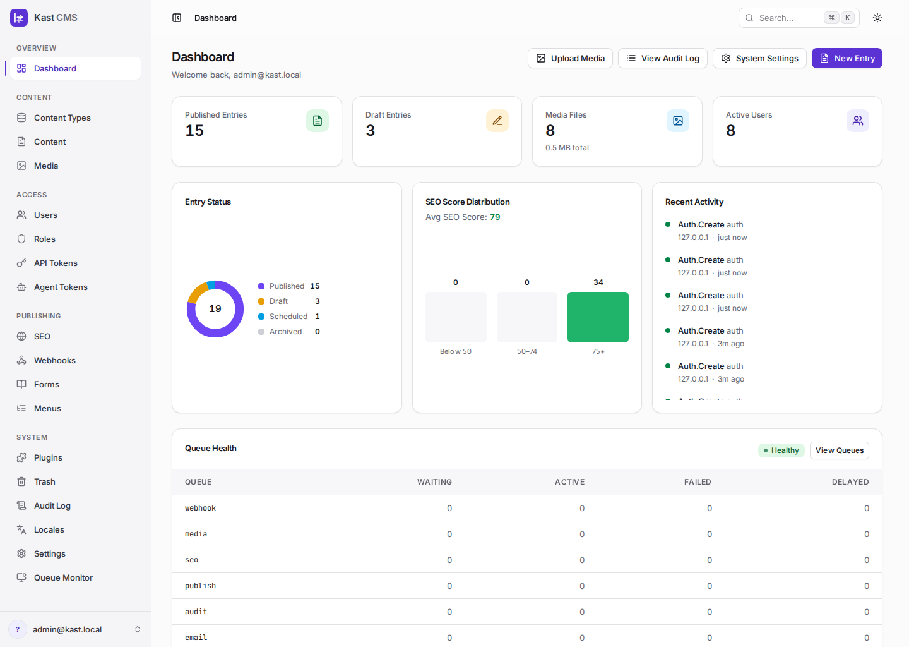
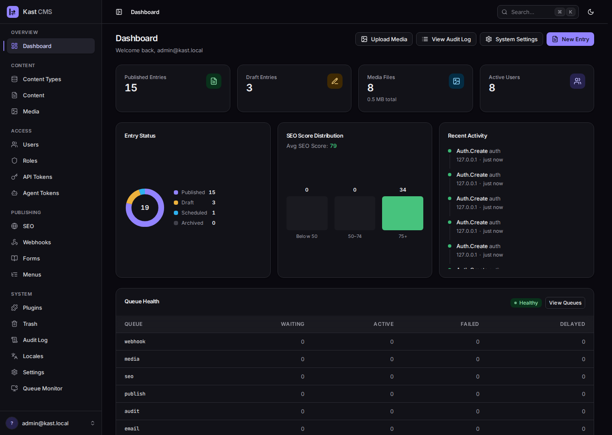

<div align="center">


# Kast CMS

### Cast Your Content Everywhere

**Open-source · AI-native · Developer-first · RTL-ready**

[](https://github.com/kast-cms/kast/stargazers)
[](./LICENSE)
[](https://nodejs.org/)
[](https://www.typescriptlang.org/)
[](https://pnpm.io/)
[](https://github.com/orgs/kast-cms/packages)

<br />

[](https://www.npmjs.com/package/@kast-cms/sdk)
[](https://www.npmjs.com/package/@kast-cms/plugin-sdk)
[](https://www.npmjs.com/package/create-kast-app)

<br />

Kast is a modern headless CMS built on **NestJS + Next.js** with a built-in **MCP server** for AI agent control, first-class **SEO tooling**, and **RTL/i18n** support from day one.

[**Docs**](https://docs.kast.dev) · [**Quick Start**](#quick-start) · [**Screenshots**](#screenshots) · [**SDK**](https://www.npmjs.com/package/@kast-cms/sdk) · [**Plugins**](#plugins) · [**Deploy**](#deploy)

</div>

---

## Screenshots

<div align="center">



<br /><br />



</div>

The admin panel is built on a purpose-built design system — OKLCH colour tokens
derived from the Kast mark, self-hosted variable typography, a full light/dark
theme, and RTL support throughout.

**[→ Every screen, in both themes](./docs/screenshots/README.md)** ·
**[→ Design system reference](./docs/architecture/KAST_DESIGN_SYSTEM.md)**

---

## Quick Start

```bash
npx create-kast-app my-site
cd my-site
# .env is copied automatically — edit it with your DB credentials
pnpm run db:migrate
pnpm run dev
```

Then open **http://localhost:3001/admin/setup** and create the owner account. Kast ships
**no default credentials** — the setup page is only reachable while the install has no users,
and it closes permanently once the first owner exists.

> **Production with Docker?** A `docker-compose.yml` is included in the generated project. Run `docker-compose up` after filling in `.env`.

| Service            | URL                              |
| ------------------ | -------------------------------- |
| Admin Panel        | http://localhost:3001/admin      |
| REST API           | http://localhost:3000/api/v1     |
| MCP Server         | http://localhost:3000/api/v1/mcp |
| API Docs (Swagger) | http://localhost:3000/api/docs   |

---

## Why Kast?

Most headless CMSes were built for an era before AI agents, before Arabic-first products, and before SEO was a core requirement rather than an afterthought. Kast is different.

### Feature Comparison

<table>
  <thead>
    <tr>
      <th>Capability</th>
      <th align="center">Kast</th>
      <th align="center">Strapi</th>
      <th align="center">Payload</th>
      <th align="center">WordPress</th>
    </tr>
  </thead>
  <tbody>
    <tr>
      <td><strong>MCP server — AI agent control</strong></td>
      <td align="center">✅ Built-in</td>
      <td align="center">❌</td>
      <td align="center">❌</td>
      <td align="center">❌</td>
    </tr>
    <tr>
      <td><strong>SEO — not a plugin</strong></td>
      <td align="center">✅ Core</td>
      <td align="center">🔌 Plugin</td>
      <td align="center">🔌 Plugin</td>
      <td align="center">🔌 Plugin</td>
    </tr>
    <tr>
      <td><strong>RTL / Arabic first-class</strong></td>
      <td align="center">✅ Core</td>
      <td align="center">⚠️ Partial</td>
      <td align="center">⚠️ Partial</td>
      <td align="center">⚠️ Partial</td>
    </tr>
    <tr>
      <td><strong>TypeScript end-to-end</strong></td>
      <td align="center">✅ Full</td>
      <td align="center">⚠️ Partial</td>
      <td align="center">✅ Full</td>
      <td align="center">❌</td>
    </tr>
    <tr>
      <td><strong>Official TypeScript SDK</strong></td>
      <td align="center">✅ <a href="https://www.npmjs.com/package/@kast-cms/sdk">@kast-cms/sdk</a></td>
      <td align="center">⚠️ Community</td>
      <td align="center">⚠️ Community</td>
      <td align="center">❌</td>
    </tr>
    <tr>
      <td><strong>Plugin SDK + marketplace</strong></td>
      <td align="center">✅ <a href="https://www.npmjs.com/package/@kast-cms/plugin-sdk">@kast-cms/plugin-sdk</a></td>
      <td align="center">✅</td>
      <td align="center">✅</td>
      <td align="center">✅</td>
    </tr>
    <tr>
      <td><strong>Content versioning</strong></td>
      <td align="center">✅ Built-in</td>
      <td align="center">✅</td>
      <td align="center">✅</td>
      <td align="center">✅</td>
    </tr>
    <tr>
      <td><strong>Scheduled publishing</strong></td>
      <td align="center">✅ Built-in</td>
      <td align="center">✅</td>
      <td align="center">⚠️ Manual</td>
      <td align="center">✅</td>
    </tr>
    <tr>
      <td><strong>Docker images published</strong></td>
      <td align="center">✅ <a href="https://github.com/orgs/kast-cms/packages">GHCR</a></td>
      <td align="center">✅</td>
      <td align="center">❌</td>
      <td align="center">✅</td>
    </tr>
    <tr>
      <td><strong>Scaffold CLI</strong></td>
      <td align="center">✅ <a href="https://www.npmjs.com/package/create-kast-app">create-kast-app</a></td>
      <td align="center">✅</td>
      <td align="center">✅</td>
      <td align="center">✅</td>
    </tr>
    <tr>
      <td><strong>Open source</strong></td>
      <td align="center">✅ MIT</td>
      <td align="center">✅ MIT</td>
      <td align="center">✅ MIT</td>
      <td align="center">✅ GPL</td>
    </tr>
  </tbody>
</table>

---

## Stack

```
┌─────────────────────────────────────────────────────┐
│                  Kast CMS v1.2.0                    │
├──────────────┬──────────────┬───────────────────────┤
│   API        │   Admin      │   Frontend            │
│   NestJS     │   Next.js 16 │   Next.js / Any       │
│   Prisma     │   App Router │   @kast-cms/sdk       │
│   PostgreSQL │   TypeScript │                       │
├──────────────┴──────────────┴───────────────────────┤
│   BullMQ + Redis  (background jobs & queues)        │
├─────────────────────────────────────────────────────┤
│   Auth: JWT · Refresh Tokens · OAuth                │
│   Storage: Local FS · S3-compatible (pluggable)     │
│   MCP Server: AI agent protocol, built-in           │
└─────────────────────────────────────────────────────┘
```

---

## npm Packages

| Package                                                                      | Version                                                                                                                           | Description                                 |
| ---------------------------------------------------------------------------- | --------------------------------------------------------------------------------------------------------------------------------- | ------------------------------------------- |
| [`@kast-cms/sdk`](https://www.npmjs.com/package/@kast-cms/sdk)               | [](https://www.npmjs.com/package/@kast-cms/sdk)               | Official TypeScript client for the Kast API |
| [`@kast-cms/plugin-sdk`](https://www.npmjs.com/package/@kast-cms/plugin-sdk) | [](https://www.npmjs.com/package/@kast-cms/plugin-sdk) | Build your own Kast plugins                 |
| [`create-kast-app`](https://www.npmjs.com/package/create-kast-app)           | [](https://www.npmjs.com/package/create-kast-app)           | Scaffold a new Kast project in seconds      |

```bash
# Use the SDK in your frontend / Next.js app
npm install @kast-cms/sdk

# Build a Kast plugin
npm install @kast-cms/plugin-sdk

# Scaffold a new project
npx create-kast-app my-site
```

---

## Plugins

First-party plugins, installable via the Kast admin:

| Plugin                         | Description                          |
| ------------------------------ | ------------------------------------ |
| `@kast-cms/plugin-stripe`      | Payments and subscription management |
| `@kast-cms/plugin-meilisearch` | Full-text search with Meilisearch    |
| `@kast-cms/plugin-resend`      | Transactional email via Resend       |
| `@kast-cms/plugin-r2`          | Media storage on Cloudflare R2       |
| `@kast-cms/plugin-sentry`      | Error tracking and monitoring        |

Build your own with [`@kast-cms/plugin-sdk`](https://www.npmjs.com/package/@kast-cms/plugin-sdk).

---

## Monorepo Structure

```
kast/
├── apps/
│   ├── api/             # NestJS backend
│   ├── admin/           # Next.js 16 admin panel
│   ├── web-blog/        # Next.js blog frontend starter
│   ├── docs/            # Astro/Starlight documentation site
│   └── web-docs/        # Next.js public-site starter
├── packages/
│   ├── sdk/             # @kast-cms/sdk — TypeScript client
│   ├── plugin-sdk/      # @kast-cms/plugin-sdk — plugin interface
│   └── create-kast-app/ # CLI scaffolding tool
└── plugins/             # First-party plugins
    ├── kast-plugin-stripe/
    ├── kast-plugin-meilisearch/
    ├── kast-plugin-resend/
    ├── kast-plugin-r2/
    └── kast-plugin-sentry/
```

---

## Development

**Prerequisites:** Node.js ≥ 20, pnpm ≥ 9, Docker

```bash
# 1. Clone
git clone https://github.com/kast-cms/kast.git
cd kast

# 2. Install dependencies
pnpm install

# 3. Configure environment
cp .env.example .env  # set JWT_SECRET (min 32 chars) at minimum
# Also set KAST_SECRET_ENCRYPTION_KEY (min 32 chars) — it encrypts secret settings
# such as smtp.password at rest. Without it Kast falls back to JWT_SECRET, which
# means rotating JWT_SECRET makes stored secrets unreadable.

# 4. Start PostgreSQL + Redis
docker compose up -d postgres redis

# 5. Run migrations + seed reference data (locales, roles, settings — no user accounts)
pnpm run db:migrate
pnpm run db:seed

# 6. Start all dev servers
pnpm dev
```

Then create the owner account at http://localhost:3001/admin/setup. The seed never creates a
login, so nothing privileged exists until you do.

**Throwaway local test accounts.** For local work only, the seed can recreate the two fixed
accounts the manual test flows use. These credentials are public knowledge, so creating them
takes a phrase no deployment picks up by accident:

```bash
SEED_DEV_ACCOUNTS=i-know-these-credentials-are-public pnpm run db:seed
#   admin@kast.local  / Admin1234!   (super_admin)
#   writer@kast.local / Writer1234!  (editor)
```

Keep that variable in your local `.env` (`.env.example` has it commented out) — the API also
reads it, and **refuses to start** while either account still has its published password and
the opt-in is absent. `NODE_ENV=production` overrides the opt-in entirely: the seed refuses to
create the accounts and the API refuses to serve with them. `NODE_ENV` alone never _grants_
anything, because a `.env` copied onto a server carries whatever value it was given on day one.

To run the full `docker compose` stack this way, set `KAST_DOCKER_NODE_ENV=development`
alongside it; the compose file otherwise pins `NODE_ENV=production` for the API container.

**A real, non-throwaway owner from the CLI.** Supply the address, and either supply the
password or let the seed generate one and print it once:

```bash
SEED_ADMIN_EMAIL=you@example.com SEED_ADMIN_PASSWORD='<min 12 chars>' pnpm run db:seed
SEED_ADMIN_EMAIL=you@example.com pnpm run db:seed   # password generated and printed once
```

An account that already exists is never re-passworded and never granted a role by the seed.

---

## Deploy

Get a production instance running in under 10 minutes:

[](https://railway.app/template/kast)
[](https://render.com/deploy?repo=https://github.com/kast-cms/kast)
[](https://vercel.com/new/clone?repository-url=https://github.com/kast-cms/kast&root-directory=apps/admin)

> **Vercel** deploys the admin panel only. Deploy the API on Railway or Render and set `NEXT_PUBLIC_API_URL` in your Vercel project settings.

### Docker

Images are hosted on GitHub Container Registry (GHCR):

```bash
# Latest stable release
docker pull ghcr.io/kast-cms/kast-api:latest
docker pull ghcr.io/kast-cms/kast-admin:latest

# Edge build (latest main branch commit)
docker pull ghcr.io/kast-cms/kast-api:edge
docker pull ghcr.io/kast-cms/kast-admin:edge
```

| Tag                | Published on           |
| ------------------ | ---------------------- |
| `latest` / `1.x.x` | Every `v*` release tag |
| `edge`             | Every merge to `main`  |

Images are built and pushed automatically via GitHub Actions.

---

## Releasing

Releases are **fully automatic and independent per package**. There is no release
PR and no manual version bumping — just merge [Conventional Commits](https://www.conventionalcommits.org/)
to `main` and CI does the rest (`.github/workflows/release.yml`).

### What happens on every merge to `main`

1. **Quality gate** runs first — `format:check`, `lint`, `typecheck`, `test`, and
   the API e2e suite (Postgres 16 + Redis 7 service containers). Nothing is
   published unless this passes.
2. **npm packages** are versioned independently by
   [`multi-semantic-release`](https://github.com/qiwi/multi-semantic-release). For
   each of the three publishable packages it analyzes the Conventional Commits that
   touched that package's directory since its last per-package tag, computes the
   next semver, bumps `package.json`, runs `npm publish --provenance`, and creates a
   per-package git tag + GitHub Release. Packages with no relevant commits are
   skipped (no version churn). The publishable packages and their tag namespaces:

   | Package                | npm                                                       | Tag format               |
   | ---------------------- | --------------------------------------------------------- | ------------------------ |
   | `create-kast-app`      | [npm](https://www.npmjs.com/package/create-kast-app)      | `create-kast-app@*`      |
   | `@kast-cms/sdk`        | [npm](https://www.npmjs.com/package/@kast-cms/sdk)        | `@kast-cms/sdk@*`        |
   | `@kast-cms/plugin-sdk` | [npm](https://www.npmjs.com/package/@kast-cms/plugin-sdk) | `@kast-cms/plugin-sdk@*` |

   The tag format is `${name}@${version}` — set by multi-semantic-release, which
   overrides any `tagFormat` in `release.config.cjs`. Every other workspace package
   (`api`, `admin`, the docs/blog apps, all `plugins/*`) is `private: true`; the
   `--ignore-private-packages` flag (in `release.yml`) skips them entirely, so they
   produce no npm publish, tag, or GitHub Release.

3. **Product release** — a product-level `vX.Y.Z` version is computed from the
   overall Conventional Commits since the last `v*` tag, the tag is pushed, the
   `api` + `admin` GHCR images are rebuilt as `:x.y.z` + `:latest`, and a product
   GitHub Release is created. `:edge` images build on **every** push to `main`
   (via `.github/workflows/publish.yml`).

### Required secrets

| Secret         | Used for                                                                       |
| -------------- | ------------------------------------------------------------------------------ |
| `NPM_TOKEN`    | `npm publish` of the three packages (an **Automation** token).                 |
| `RELEASE_PAT`  | Pushing the product `vX.Y.Z` tag (a PAT with `repo` scope / `contents:write`). |
| `GITHUB_TOKEN` | Per-package tags + GitHub Releases + GHCR push (provided automatically).       |

> **Why `RELEASE_PAT`?** Tags pushed with the default `GITHUB_TOKEN` do not
> re-trigger workflows. The Docker build runs in the **same** workflow run, so it
> does not depend on a re-trigger — but the product tag is pushed with `RELEASE_PAT`
> so it stays robust if a tag-triggered workflow is ever added.

### One-time bootstrap (run before the first automated release)

semantic-release derives the next version from the latest **git tag** in each
package's namespace, not from `package.json`. The packages are already past their
first release (`create-kast-app@2.1.0`, `@kast-cms/sdk@0.3.2`,
`@kast-cms/plugin-sdk@0.1.0`) but have no per-package tags yet. Seed baseline tags
once so the first run bumps from the correct floor (and never downgrades):

```bash
git checkout main && git pull
pnpm install
node scripts/bootstrap-release-tags.mjs   # add --dry-run to preview
git push origin --tags
```

### Branch protection

Protect `main`: require the CI checks to pass and merge via PR. The `release.yml`
quality gate re-runs the full suite on the merge commit before anything publishes.

---

## Documentation

Full docs at [docs.kast.dev](https://docs.kast.dev)

- [Getting Started](https://docs.kast.dev/getting-started/installation/)
- [API Reference](https://docs.kast.dev/api-reference/authentication/)
- [SDK Guide](https://docs.kast.dev/sdk/installation/)
- [Plugin Development](https://docs.kast.dev/plugins/what-is-a-plugin/)
- [MCP Server](https://docs.kast.dev/mcp/connecting-claude/)
- [SEO Tooling](https://docs.kast.dev/concepts/seo-module/)

In this repository:

- [Design System](./docs/architecture/KAST_DESIGN_SYSTEM.md) — tokens, typography and component rules for the admin panel
- [Admin Screenshots](./docs/screenshots/README.md) — every screen, light and dark
- [Dev Standards](./docs/architecture/KAST_DEV_STANDARDS.md) · [Security Model](./docs/architecture/KAST_SECURITY_MODEL.md) · [Database Schema](./docs/architecture/KAST_DATABASE_SCHEMA.md)

---

## Contributing

Contributions are welcome! See [CONTRIBUTING.md](./CONTRIBUTING.md) for guidelines.

- [Report a Bug](https://github.com/kast-cms/kast/issues/new?template=bug_report.md)
- [Request a Feature](https://github.com/kast-cms/kast/issues/new?template=feature_request.md)
- [Join Discord](https://discord.gg/kast-cms)

---

## About the Author

Kast is built and maintained by **Oday Bakkour** — a full-stack engineer and open-source developer passionate about developer tooling, AI-native products, and building great experiences for Arabic-speaking users.

→ [oday-bakkour.com](https://oday-bakkour.com/)

---

## License

[MIT](./LICENSE) © 2026 Oday Bakkour
